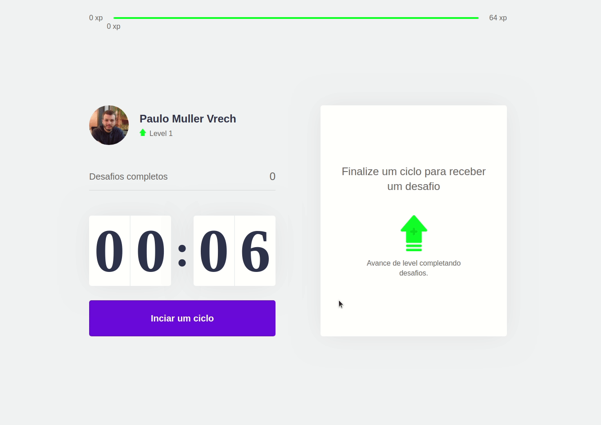

<h1 align="center">
    <a href="https://moveit-paulomvrech.vercel.app/"></a>
</h1>

## 💻 Sobre o projeto
O <strong>Moveit</strong> foi criado com o intuito de ajudar pessoas que passam muito tempo em frente ao computador a realizar uma pausa e fazer um desafio.
A cada desafio concluido, a pessoa recebe uma quantidade de XP de acordo com o desafio proposto, e assim vai aumentando de nível ao atingir a experiência máxima.

Este é um projeto desenvolvido durante a **[Next Level Week](https://nextlevelweek.com/)**, realizada pela **[@Rocketseat](https://github.com/Rocketseat)** durante os dias 22 a 28 de Fevereiro de 2021.

Realizei o deploy deste projeto na Vercel, [clique aqui](https://moveit-paulomvrech.vercel.app/) para conferir.

---

## 👀 Demo
<div align="center">
    
</div>


---

## 🚀 Tecnologias utilizadas

Esse projeto foi desenvolvido utilizando as seguintes tecnologias:

- [Next.js](https://nextjs.org/)
- [React](https://reactjs.org)
- [TypeScript](https://www.typescriptlang.org/)

---

## 🛠 Como executar o projeto em sua máquina

```bash

# Clone este repositório
$ git clone git@github.com:paulomvrech/moveit-nextJS.git

# Acesse a pasta do projeto no seu terminal/cmd
$ cd moveit-next

# Instale as dependências
$ npm install ou yarn install

# Execute a aplicação em modo de desenvolvimento
$ npm run dev ou yarn dev

# A aplicação será aberta na porta:3000 - acesse http://localhost:3000

```

---

<p align="center">Desenvolvido por 👏 Paulo Muller Vrech</p>